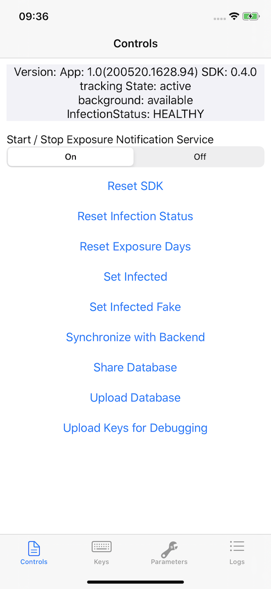
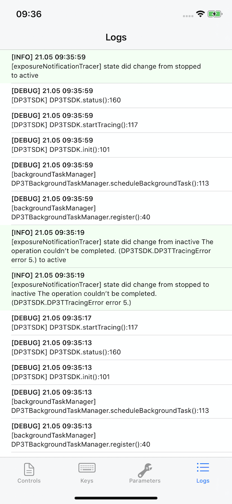
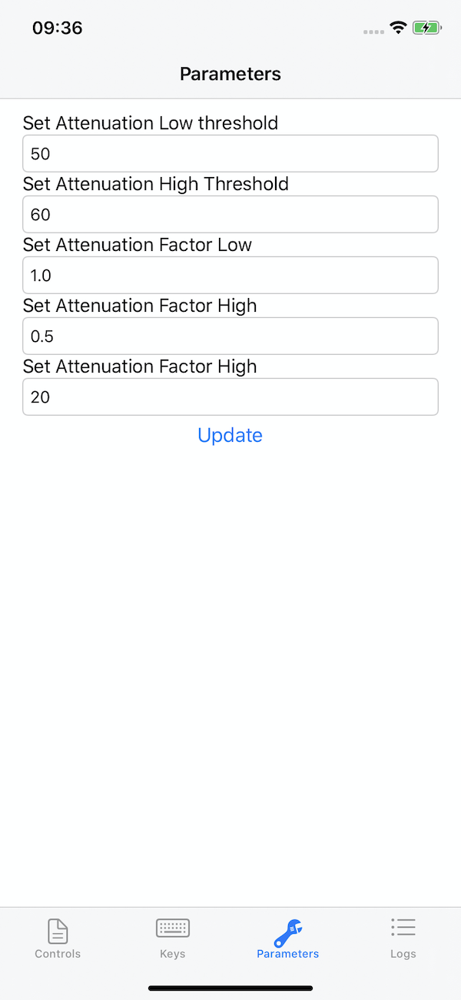

# DP3T-SDK for iOS
[](https://github.com/apple/swift-package-manager)
[](https://github.com/DP-3T/dp3t-sdk-ios/blob/master/LICENSE)


## DP3T
The Decentralised Privacy-Preserving Proximity Tracing (DP-3T) project is an open protocol for COVID-19 proximity tracing using Bluetooth Low Energy functionality on mobile devices that ensures personal data and computation stays entirely on an individual's phone. It was produced by a core team of over 25 scientists and academic researchers from across Europe. It has also been scrutinized and improved by the wider community.

DP-3T is a free-standing effort started at EPFL and ETHZ that produced this protocol and that is implementing it in an open-sourced app and server.


## Introduction
This is the first implementation of the DP-3T "low bandwidth" protocol. The current implementation does not use the as yet unreleased "Contact Tracing" API of Apple/Google--**and has limitations as a result**. Our "hybrid approach" uses Bluetooth Low Energy (BLE) to exchange `EphID`s. It uses advertisements whenever possible and falls back to GATT Server connections if not possible to transmit/collect an `EphID` this way (e.g., on iOS devices when the app is in background). This approach can result in higher energy consumption and scalability issues and will be replaced by the Apple/Google API.

Our immediate roadmap is: to support the Apple/Google wire protocol, to be forward-compatible, and to support the actual Apple/Google API as soon as it is released to iOS and Android devices.

## Repositories
* Android SDK & Calibration app: [dp3t-sdk-android](https://github.com/DP-3T/dp3t-sdk-android)
* iOS SDK & Calibration app: [dp3t-sdk-ios](https://github.com/DP-3T/dp3t-sdk-ios)
* Android Demo App: [dp3t-app-android](https://github.com/DP-3T/dp3t-app-android)
* iOS Demo App: [dp3t-app-ios](https://github.com/DP-3T/dp3t-app-ios)
* Backend SDK: [dp3t-sdk-backend](https://github.com/DP-3T/dp3t-sdk-backend)

## Work in Progress
The DP3T-SDK for iOS contains alpha-quality code only and is not yet complete. It has not yet been reviewed or audited for security and compatibility. We are both continuing the development and have started a security review. This project is truly open-source and we welcome any feedback on the code regarding both the implementation and security aspects.
This repository contains the open prototype SDK, so please focus your feedback for this repository on implementation issues.

## Further Documentation
The full set of documents for DP3T is at https://github.com/DP-3T/documents. Please refer to the technical documents and whitepapers for a description of the implementation.

## Architecture
A central discovery service is hosted on [Github](https://github.com/DP-3T/dp3t-discovery). This server provides the necessary information for the SDK to initialize itself. After the SDK loads the base url for its own backend, it will load the infected list from there, as well as post if a user is infected. This will also allow apps to fetch lists from other backend systems participating in this scheme and can handle roaming of users.

## Calibration App
Included in this repository is a Calibration App that can run, debug and test the SDK directly without implementing it in a new app first. It collects additional data and stores it locally into a database to allow for tests with phones from different vendors. Various parameters of the SDK are exposed and can be changed at runtime. Additionally it provides an overview of how to use the SDK.

<p align="center">
  
  
  
</p>


## Function overview

### Initialization
Name | Description | Function Name
---- | ----------- | -------------
init | Initializes the SDK and configures it |  `func initialize(with appId: String, enviroment: Enviroment`

### Methods 
Name | Description | Function Name
---- | ----------- | -------------
startTracing | Starts Bluetooth tracing | `func startTracing() throws`
stopTracing | Stops Bluetooth tracing | `func stopTracing()`
sync | Pro-actively triggers sync with backend to refresh exposed list | `func sync(callback: ((Result<Void, DP3TTracingErrors>) -> Void)?)`
status | Returns a TracingState-Object describing the current state. This contains:<br/>- `numberOfHandshakes` : `Int` <br /> - `trackingState` : `TrackingState` <br /> - `lastSync` : `Date` <br /> - `infectionStatus`:`InfectionStatus` | `func status(callback: (Result<TracingState, DP3TTracingErrors>) -> Void)`
iWasExposed | This method must be called upon positive test. | `func iWasExposed(onset: Date, authString: String, callback: @escaping (Result<Void, DP3TTracingErrors>) -> Void)`
reset | Removes all SDK related data (key and database) and de-initializes SDK | `func reset() throws`


## Installation
### Swift Package Manager

DP3T-SDK is available through [Swift Package Manager](https://swift.org/package-manager)

1. Add the following to your `Package.swift` file:

  ```swift

  dependencies: [
      .package(url: "https://github.com/DP-3T/dp3t-sdk-ios.git", branch: "develop")
  ]

  ```

## Using the SDK

### Initialization
In your AppDelegate in the `didFinishLaunchingWithOptions` function you have to initialize the SDK with
```swift
try DP3TTracing.initialize(with: "com.example.your.app", enviroment: .prod)
```
The provided app name has to be registered in the discovery service on [Github](https://raw.githubusercontent.com/SecureTagForApproachRecognition/discovery/master/discovery.json)

### Start / Stop tracing
To start and stop tracing use
```swift
try DP3TTracing.startTracing()
D3PTTracing.stopTracing()
```
Make sure that the app includes in the `Info.plist` the bluetooth keys `NSBluetoothAlwaysUsageDescription` and `NSBluetoothPeripheralUsageDescription` and that the user has granted the app permission to use the Bluetooth periferals. Also the app as to support `BackgroundMode` capability for `bluetooth-central` and `bluetooth-peripheral`.

`Info.plist` sample:
```swift
<key>UIBackgroundModes</key>
  <array>
    <string>bluetooth-central</string>
    <string>bluetooth-peripheral</string>
  </array>
<key>NSBluetoothAlwaysUsageDescription</key>
  <string>User facing text justifying bluetooth usage</string>
<key>NSBluetoothPeripheralUsageDescription</key>
  <string>User facing text justifying bluetooth usage</string>
```

### Checking the current tracing status
```swift
DP3TTracing.status(callback: (Result<TracingState, DP3TTracingErrors>) -> Void)
```
The `TracingState` object contains all information regarding the current tracing status.

To receive callbacks and notifications when the state changes, you should assign a delegate object conforming to `DP3TTracingDelegate`:
```swift
DP3TTracing.delegate = yourDelegateObject // weak retained by the SDK

// Delegate method
func DP3TTracingStateChanged(_ state: TracingState) {

}
```
The SDK will call your delegate on every state change, this includes: Handshake detection, start/stop of tracing, change in exposure, errors...

### Report user exposed
```swift
D3PTTracing.iWasExposed(onset: Date(), authString: "") { result in
	// Handle result here
}
```

### Sync with backend for exposed user
The SDK does not automatically sync with the backend for new exposed users. The app is responsible for fetching the new exposed users as it sees fit (periodically or via user input):
```swift
D3PTTracing.sync() { result in
	// Handle result here
}
```

## License
This project is licensed under the terms of the MPL 2 license. See the [LICENSE](LICENSE) file.